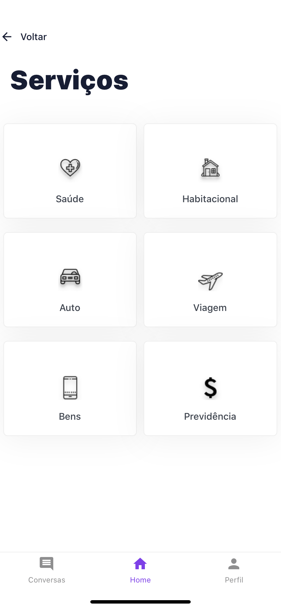

<h1>
  GR1d - Tô Safe
</h1>

<small>
 
<a href="https://www.figma.com/file/1MI8biqg49lvJYgN6UFLrX/T%C3%B4-Safe-UX-Project">Figma</a> 
<a href="https://canvanizer.com/canvas/wXS537Ysc8MZO">Canvas</a> 
<a href="https://drive.google.com/drive/folders/1MGSagMQbznEedDt5zCGnnCPfHwTNdCsX">Sobre</a> 
<a href="https://youtu.be/mPAgsnyI9wU">Youtube Video</a>
</small>

## Features

This back-end features the latest tools and practices in web development!

- 💹 **React Native** — Our beloved one to make apps
- 💖 **Expo** — No words to describe you.
- 💖 **Redux** — A predictable state container for JavaScript apps.
- 💖 **Firebase** — Google's mobile platform
- 💖 **Styled Components** — CSS in JS, Oh Yeah!

I've used other libraries too, but the big ones are above.

## Getting started

First you need to have `node` or `yarn` installed on your machine.
Then, you can clone this repository and run the following commands inside the project folder:

1. `git clone https://github.com/robertveloso/to-safe.git`

2. `yarn start`;

## :memo: License

This project is licensed under the MIT license. See the file [LICENSE](LICENSE.md) to obtain more details.

## Challenge

> 1. Desafio: Buscar novas soluções para apoiar as corretoras de seguros a fazerem sua transformação digital utilizando os diferentes serviços que a Plataforma de Negócios oferece.
> 2. O Mercado que irá atuar: Mercado de Seguros/Corretoras de Seguros
> 3. Qual é a solução: Inicialmente o app Tô Safe em versões Corretor e Cliente.
> 4. Nossos diferenciais: Usar inteligência dos dados para identificar perfis de consumo dos segurados, correlacionar serviços e oferecer descontos; Serviços integrados à plataforma; Corretores procurando um novo canal de vendas e apoio da tecnologia.

---

Made with love ♥ by Robert Veloso :wave:.
[Get in touch with me, Developer](https://www.linkedin.com/in/robertveloso/),
[or discord me!](https://discordapp.com/channels/@me/robertveloso#1547)

Our hackathon team: 
[@Linkedin do Gilberto Aristeu, Business](https://www.linkedin.com/in/gilbertoabneto/)
[@Linkedin do Aldo Rocha, Business](https://www.linkedin.com/in/aldorochap/)
[@Linkedin da Shirleide Silva, Business](https://www.linkedin.com/in/shirleide/)
[@Linkedin do Victor Lins, UI/UX Designer](https://www.linkedin.com/in/victorlinsgomes)
